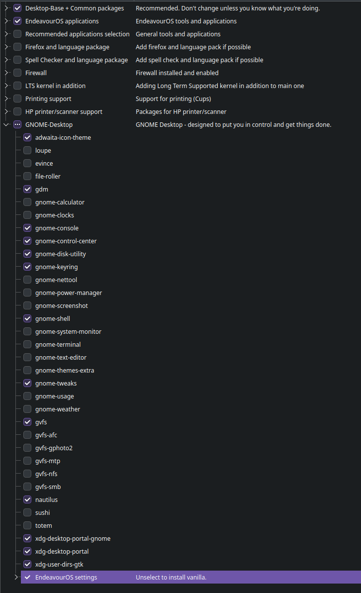
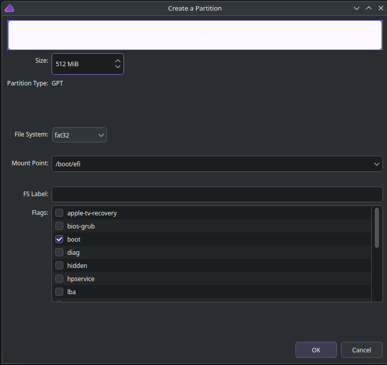

# linux-setup

# 🧪 EndeavourOS Installation Guide

This guide documents how to install **EndeavourOS with Btrfs, minimal GNOME, and Timeshift autosnap support**, using a clean and reproducible profile.

---

## 📦 1. Package Selection (Minimal GNOME)

After launching the installer, select your packages:

### ✅ Enable
- `Desktop-Base + Common packages`
- `EndeavourOS applications`
- `GNOME Desktop`
  - Only minimal components:
    - `gdm`, `gnome-shell`, `nautilus`, `gnome-console`, `gnome-tweaks`, `gnome-control-center`, etc.

### ❌ Disable
- Recommended apps
- Firefox/language packs
- Printing, firewall, LTS kernel, HP support



👉 See [`installer-selections.md`](installer-selections.md) for a complete checklist.

---

## ⚙️ 2. Bootloader (UEFI)

Choose the **system bootloader** and confirm you're installing in UEFI mode. The system will expect a `/boot/efi` FAT32 partition.


---

## 💽 3. Manual Partitioning (Btrfs + EFI)

Choose **Manual Partitioning** and create the following layout:

### ➤ EFI System Partition
- Size: `512 MiB`
- File System: `fat32`
- Mount Point: `/boot/efi`
- Flag: ✅ `boot`



### ➤ Root Partition
- Size: Remaining disk
- File System: `btrfs`
- Mount Point: `/`
- No flags


---

## 🔧 4. Finish Installation

Continue with the install and reboot into your new GNOME system.

---

## 🚀 5. Post-Install Setup

Clone your setup repository and run the script:

```bash
git clone https://github.com/YOUR-USERNAME/linux-setup.git
cd linux-setup
./Timeshift\ Autosnap\ Setup --virt=vmware
